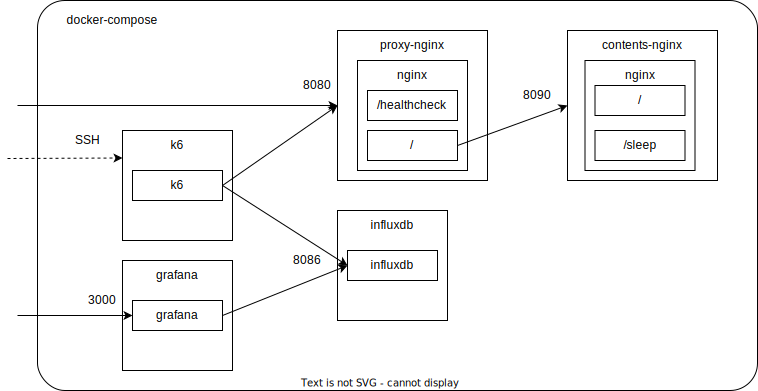

# nginx-rate-limit-poc

nginx の rate-limit の動作検証

## 構成図



## docker-compose 操作

```sh
# 起動
docker-compose up -d

# nginx 設定反映
# default.confをマウントしているので、ホスト側で修正して即反映可能
docker-compose restart proxy-nginx

# 停止
docker-compose down
```

## proxy サーバ

```sh
# コンテナに入る
docker exec -it proxy-nginx bash

# SSHせず標準出力をtailする
docker-compose log -f proxy-nginx
```

## contents サーバ

```sh
# コンテナに入る
docker exec -it contents-nginx bash

# SSHせず標準出力をtailする
docker-compose log -f contents-nginx
```

## k6 サーバ

```sh
# コンテナに入る
docker exec -it k6 sh

# k6 を実行する
k6 run /src/script.js

# 実行結果をinfluxdbに格納する場合のk6実行
k6 run --out influxdb=http://influxdb:8086/k6 - < /src/script.js

# リクエストパスを変更する
TARGET_PATH={任意のパス}
```

## Grafana セットアップ

- `localhost:3000` にアクセス。（ 初期設定は `admin/admin` ）
- 左メニューの設定（歯車）から、Datasource 追加
  - 事前に k6 のデータを influxdb に流しておく（influxdb にデータベースがないと検知できない）
  - エンドポイントを指定 `http://influxdb:8086` (docker network 内のホスト名)
  - データベース名を指定 `k6` (k6 の output で指定した名前)
- ダッシュボードを追加
  - https://grafana.com/grafana/dashboards/2587-k6-load-testing-results/
  - https://grafana.com/grafana/dashboards/10660-k6-load-testing-results/
